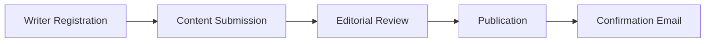

# ✦ CampusQuill

### *Where Student Voices Find Their Words*

**A thoughtfully crafted literary platform celebrating the creativity of college writers**

[**Live Demo**](https://campus-quill-beta.vercel.app/) • [**Submit Your Work**](#-publication-workflow) • [**Join Our Community**](#-creator-ecosystem)

---

## 📖 Overview

CampusQuill is more than a digital publishing platform—it's a carefully curated literary ecosystem designed to amplify student voices. By bridging the aesthetic elegance of traditional literary magazines with modern web technology, we've created a space where poetry, prose, essays, and quotes flourish.

Our platform serves as a creative sanctuary for college writers, providing them with professional-grade publishing infrastructure while maintaining the intimacy and authenticity of student expression.

---

## 🎨 Design Philosophy

### Aesthetic Excellence Meets Functional Design

CampusQuill transcends conventional content platforms through intentional design choices that prioritize reader experience and writer visibility:

#### **Typography-First Approach**
- **Optimized Readability:** Custom-tuned line heights and professional serif/sans-serif font pairings ensure extended reading sessions remain comfortable and engaging
- **Script Intelligence:** Adaptive typography that seamlessly transitions between Latin and Indic scripts (English/Bengali), maintaining optimal legibility across languages

#### **Modern Visual Architecture**
- **Dynamic Grid Systems:** Asymmetric, responsive layouts that break free from monotonous blog templates, creating visual interest while maintaining content hierarchy
- **Micro-Interaction Design:** Thoughtfully implemented animations and hover states that enhance user engagement without compromising performance
- **Progressive Enhancement:** Core content remains accessible while advanced features gracefully enhance the experience for modern browsers

#### **Performance-Driven Development**
- **Optimized Asset Delivery:** Lazy-loading images and code-splitting ensure rapid page loads even on slower connections
- **Smooth Scroll Behaviors:** Native browser APIs provide buttery-smooth navigation without JavaScript overhead

---

## 🚀 Feature Set

### 📣 **Real-Time Content Discovery**

#### Dynamic Broadcast System
A persistent notification ticker positioned at the viewport apex delivers instant updates about:
- Fresh publication releases
- Featured writer spotlights
- Community announcements
- Editorial highlights

#### Immersive Landing Experience
Our hero section welcomes visitors with:
- **Live Statistics Dashboard:** Real-time counters tracking platform metrics (total writers, published works, community engagement)
- **Visual Storytelling:** High-impact imagery paired with mission-driven copy
- **Instant Navigation:** Strategic CTAs guiding users to content discovery, submission portals, and writer profiles

---

### 🔍 **Advanced Content Curation**

#### Editor's Choice Collection
A dedicated showcase featuring:
- Weekly handpicked exceptional submissions
- Enhanced visibility for standout creators
- Curated thematic collections
- Cross-promotional opportunities for emerging voices

#### Intelligent Filtering Matrix
Sophisticated discovery tools enabling readers to explore content by:

| **Category** | **Description** |
|--------------|-----------------|
| 🎭 Poetry (কবিতা) | Verse, free-form, traditional structures |
| 📚 Prose (গল্প) | Short stories, flash fiction, narratives |
| 💭 Quotes & Musings | Aphorisms, reflections, micro-content |
| ✍️ Essays & Critiques | Long-form analysis, commentary, reviews |

**Smart Search Features:**
- Real-time filtering without page reloads
- Combined category and keyword search
- Graceful empty states with actionable suggestions
- Tag-based content clustering

---

### 👥 **Creator Ecosystem**

#### Writer Portfolio System
- **Centralized Author Directory:** Comprehensive listing of all platform contributors
- **Individual Profile Pages:** Dedicated spaces showcasing each writer's complete bibliography
- **Bio & Social Links:** Personal branding opportunities with external profile connections
- **Contribution Tracking:** Automated cataloging of published works per author

#### Frictionless Onboarding
Designed for simplicity without sacrificing data integrity:
- **Google Forms Integration:** Streamlined writer registration capturing essential metadata
- **Email-Based Submission:** One-click `mailto` protocol for manuscript delivery
- **Zero-Friction Barrier:** No complex CMS training or backend access required

---

### 📚 **Integrated Educational Network**

#### Cross-Platform Synergy
CampusQuill extends beyond literary publishing through strategic integration with:

**[AS-e-Library](https://arka-html.github.io/AS-e-Library/index.html)** — Our companion digital library platform

This interconnected ecosystem transforms a reading platform into a comprehensive educational resource hub, offering:
- Curated academic materials
- Reference collections
- Study resources
- Multimedia learning content

---

## 🛠️ Publication Workflow

### A Simplified Three-Step Publishing Process

We've eliminated technical barriers to enable student authors to focus solely on their craft:

#### **Step 1: Registration**
- Complete our streamlined Google Form
- Provide basic author information (name, institution, bio, social links)
- One-time process for platform access

#### **Step 2: Submission**
- Email your manuscript to our editorial inbox
- Supported formats: `.docx`, `.pdf`, `.txt`, or plain text in email body
- Include: Title, category, preferred publication name

#### **Step 3: Review & Publication**
- **Verification Process:** Our editorial team reviews submissions for quality and platform guidelines
- **Turnaround Time:** 24-48 hours for most submissions
- **Publication:** Approved works are formatted, uploaded, and published
- **Confirmation:** Authors receive email notification with live publication link

### 📋 Submission Guidelines

- **Original Work Only:** All submissions must be previously unpublished
- **Language Support:** English, Bengali, or bilingual submissions welcome
- **Content Standards:** Family-friendly, respectful, constructive content
- **Attribution:** Proper citation required for quoted material or references

---

## 📸 Platform Gallery

### Homepage & Hero Section

*Dynamic landing experience with real-time platform metrics and call-to-action navigation*

---

### Content Discovery Interface

*Advanced filtering matrix enabling granular content discovery by category, author, and keywords*

---

### Editor's Choice Showcase

*Weekly handpicked selections highlighting exceptional student creativity*

---

### Article Reading Experience

*Immersive reading interface optimized for long-form content consumption*

---

## 🤝 Contributing

We welcome contributions from developers, designers, and content creators! Here's how you can get involved:

### For Developers
- **Bug Reports:** Submit issues via GitHub Issues
- **Feature Requests:** Propose enhancements through pull requests
- **Code Contributions:** Fork the repository and submit PRs following our coding standards

### For Writers
- Follow our [Publication Workflow](#-publication-workflow) to submit your creative work
- Engage with published content through our platform
- Share CampusQuill within your academic community

### For Designers
- UI/UX improvement suggestions
- Graphic design contributions (banners, promotional materials)
- Accessibility enhancements

---

## 📄 License

This project is licensed under the **MIT License** - see the [LICENSE](LICENSE) file for details.

---

## 🌟 Acknowledgments

CampusQuill exists because of:
- **Student Writers** who trust us with their creative voices
- **Editorial Team** dedicating time to content curation
- **Development Contributors** building and maintaining platform infrastructure
- **Reader Community** supporting emerging literary talent

---

## 📬 Contact & Support

- **Platform Issues:** Open a GitHub issue
- **Content Submissions:** [Submit through our workflow](#-publication-workflow)
- **General Inquiries:** Reach out via our contact form on the live site
- **Community Discussion:** Join our [community forum/Discord] *(link if available)*

---

**Built with ❤️ for student writers everywhere**

[⬆ Back to Top](#-campusquill)

